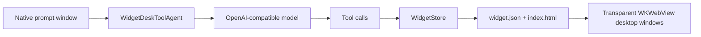

# WidgetDesk

> Generate beautiful, interactive macOS desktop widgets with one prompt.

[](#requirements)
[](apps/macos-host/Package.swift)
[](#configure-your-model)
[](LICENSE)

WidgetDesk is a native macOS app agent for your desktop.

Open a small prompt box, describe the widget you want, and WidgetDesk writes the files, renders it as a transparent desktop window, and keeps it editable. Clocks, pomodoro timers, system cards, sticky notes, tiny controls, playful one-off tools - all generated into local files you can inspect and change.


## Why This Is Cool

Most AI app builders stop inside a browser tab. WidgetDesk puts the result directly on your Mac desktop.

- Native macOS host: no Electron shell and no external widget daemon.
- OpenAI-compatible: use OpenAI or any provider that exposes `/v1/chat/completions`.
- Real files, not magic: every widget is a `widget.json` manifest plus an `index.html`.
- Local agent harness: the model can list, read, edit, show, and hide components through constrained tools.
- Desktop-native behavior: widgets can be interactive, draggable, hidden from the menu, and reloaded automatically.
- Designed for taste: compact macOS-style widgets, translucent surfaces, sane layout defaults.

## What You Can Ask For

```text
Create a minimal pomodoro timer in the bottom left
Add a tiny system stats widget in the top right
Make a glassy clock with date and seconds
Create a sticky note that remembers what I type
Hide the pomodoro widget
Make the weather card darker and smaller
```

## Quick Start

Clone the repo and run the native host:

```bash
git clone https://github.com/paranoidearth/widgetdesk.git
cd widgetdesk/apps/macos-host
swift run WidgetDeskHost
```

The host opens a small native prompt window. Type what you want, press Return, and WidgetDesk will generate or edit a desktop widget.

For development, you can also build everything first:

```bash
cd apps/macos-host
swift build
swift run WidgetDeskHost
```

## Configure Your Model

Open WidgetDesk settings from the app menu or the `WD` menu-bar item.

Set:

```text
Base URL: https://api.openai.com/v1
Model:    gpt-4.1-mini, gpt-4.1, or any compatible model
API Key:  stored locally in macOS Keychain
```

Any OpenAI-compatible endpoint should work as long as it supports chat completions and tool calls.

## The Widget Format

WidgetDesk widgets live here:

```text
~/Library/Application Support/WidgetDesk/widgets/
```

Each widget is a folder:

```text
my-widget/
  widget.json
  index.html
```

Example manifest:

```json
{
  "id": "my-widget",
  "name": "My Widget",
  "entry": "index.html",
  "x": 40,
  "y": 90,
  "width": 320,
  "height": 160,
  "interactive": false,
  "visible": true,
  "anchor": "bottom-right"
}
```

`index.html` is a complete self-contained HTML document rendered inside a transparent `WKWebView`.

## CLI

WidgetDesk ships a small CLI for inspecting and managing widgets:

```bash
cd apps/macos-host

swift run widgetdesk -- list
swift run widgetdesk -- create clock my-clock
swift run widgetdesk -- hide my-clock
swift run widgetdesk -- show my-clock
swift run widgetdesk -- delete my-clock
swift run widgetdesk -- path
swift run widgetdesk -- doctor
```

There is also an offline template planner:

```bash
swift run widgetdesk-agent -- add a clock on the top right
swift run widgetdesk-agent -- create a pomodoro timer bottom left
```

The native app path uses the LLM tool agent.

## How It Works



The model never gets arbitrary filesystem access. It can only call a small set of tools:

- `list_components`
- `read_component_file`
- `edit_component_file`
- `set_component_visibility`

`WidgetStore` validates component IDs, scopes file writes to the app-support widget directory, and owns all manifest updates.

## Project Layout

```text
apps/macos-host/
  Package.swift
  Sources/
    WidgetDeskCore/     # widget manifests, store, settings, templates, LLM tool agent
    WidgetDeskHost/     # native macOS app, prompt window, settings, menu, widget windows
    WidgetDeskCLI/      # widget management CLI
    WidgetDeskAgent/    # offline prompt-to-template entrypoint

docs/
  architecture/         # migration and architecture notes
  images/               # README screenshots
```

The older skill-based workflow is kept only as migration material. The standalone macOS app under `apps/macos-host` is the source of truth.

## Built-In Templates

| Template | Purpose | Default Anchor |
| --- | --- | --- |
| `clock` | Time and date card | Bottom right |
| `pomodoro` | Interactive focus timer | Bottom left |
| `system-stats` | CPU/memory/battery-style pulse card | Top right |
| `memo` | Editable sticky note | Top center |
| `tap-counter` | Interactive persisted counter | Bottom right |

## Roadmap

- Packaged `.app` release builds
- Widget gallery and one-click installs
- Better generated-widget preview before placing on desktop
- Component version history and rollback
- More host tools for structured component editing
- Optional local model profiles

## Requirements

- macOS 13+
- Swift 6 toolchain / Xcode command line tools
- An OpenAI-compatible API key for generation

## Status

WidgetDesk is early, fast-moving, and meant for people who like building their own desktop. Expect rough edges, but the core loop is already here:

prompt -> local files -> desktop widget -> refine -> keep.

## License

MIT
